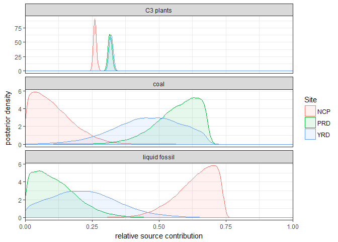

Regionally-varying combustion sources of the January 2013 severe haze events over eastern China - Bayesian computations
================

This repository reproduces the analysis behind the Bayesian sourse apportionment analysis in ["Regionally-varying combustion sources of the January 2013 severe haze events over eastern China", *Environmental science & technology 49 (4), 2038-2043.*](https://pubs.acs.org/doi/abs/10.1021/es503855e). For more details, consult the article and its suplementary material.

``` r
library(tidyverse)
library(rjags)

run_jags <- function(data, model_file = "model.jags"){
    # Takes data from a site, runs RJAGS on model_file 
    # and returns draws from posterior proportions in 
    # long format
    jags_data <- list(n = nrow(data), d13C = data$d13C, D14C = data$D14C)
    model <- jags.model(file = model_file,
                        data = jags_data, 
                        n.chains = 1, 
                        n.adapt = 10000,
                        quiet = TRUE)
    update(model, 1000)
    coda.samples(model, variable.names = "p", 
                 n.iter = 5000000,
                 thin = 100) %>% 
        as.matrix() %>% 
        as.tibble() %>% 
        rename(`C3 plants` = `p[1]`, 
               `liquid fossil` = `p[2]`, 
               `coal` = `p[3]`) %>% 
        gather() %>% 
        mutate(Site = data$Site[1])
}

# Reads data from Table S2
data <- read_delim("isotope_data.csv", delim = ";") %>% 
    na.omit()

# Splits data according to Site, runs run_jags fro each
# site and plot posterior densities corresponding to Figure S10
split(data, data$Site) %>% 
    map(run_jags) %>% 
    map_df(bind_rows) %>% 
    ggplot(aes(x = value, fill = Site, color = Site), size = 1) + 
    geom_density(alpha = .1) +
    facet_wrap(~key, nrow = 3, scales = "free_y") +
    xlab("relative source contribution") +
    ylab("posterior density") +
    scale_x_continuous(expand = c(0, 0), limits = c(0, 1)) + 
    theme_bw()
```



``` r
sessionInfo()
```

    ## R version 3.4.2 (2017-09-28)
    ## Platform: x86_64-w64-mingw32/x64 (64-bit)
    ## Running under: Windows 7 x64 (build 7601) Service Pack 1
    ## 
    ## Matrix products: default
    ## 
    ## locale:
    ## [1] LC_COLLATE=Swedish_Sweden.1252  LC_CTYPE=Swedish_Sweden.1252   
    ## [3] LC_MONETARY=Swedish_Sweden.1252 LC_NUMERIC=C                   
    ## [5] LC_TIME=Swedish_Sweden.1252    
    ## 
    ## attached base packages:
    ## [1] stats     graphics  grDevices utils     datasets  methods   base     
    ## 
    ## other attached packages:
    ##  [1] bindrcpp_0.2    rjags_4-6       coda_0.19-1     forcats_0.2.0  
    ##  [5] stringr_1.2.0   dplyr_0.7.4     purrr_0.2.4     readr_1.1.1    
    ##  [9] tidyr_0.7.2     tibble_1.4.2    ggplot2_2.2.1   tidyverse_1.2.1
    ## 
    ## loaded via a namespace (and not attached):
    ##  [1] Rcpp_0.12.13     cellranger_1.1.0 pillar_1.1.0     compiler_3.4.2  
    ##  [5] plyr_1.8.4       bindr_0.1        tools_3.4.2      digest_0.6.12   
    ##  [9] lubridate_1.7.1  jsonlite_1.5     evaluate_0.10.1  nlme_3.1-131    
    ## [13] gtable_0.2.0     lattice_0.20-35  pkgconfig_2.0.1  rlang_0.1.6     
    ## [17] psych_1.7.8      cli_1.0.0        rstudioapi_0.7   yaml_2.1.14     
    ## [21] parallel_3.4.2   haven_1.1.0      xml2_1.1.1       httr_1.3.1      
    ## [25] knitr_1.17       hms_0.3          rprojroot_1.2    grid_3.4.2      
    ## [29] glue_1.2.0       R6_2.2.2         readxl_1.0.0     foreign_0.8-69  
    ## [33] rmarkdown_1.6    modelr_0.1.1     reshape2_1.4.2   magrittr_1.5    
    ## [37] backports_1.1.1  scales_0.5.0     htmltools_0.3.6  rvest_0.3.2     
    ## [41] assertthat_0.2.0 mnormt_1.5-5     colorspace_1.3-2 labeling_0.3    
    ## [45] stringi_1.1.5    lazyeval_0.2.0   munsell_0.4.3    broom_0.4.2     
    ## [49] crayon_1.3.4
